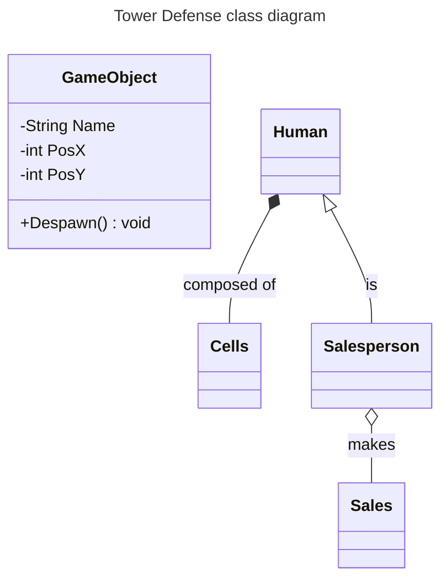

# Mermaid (mermaid.live)

## Class Diagrams

### Syntax Exemple

#### Connectors

    <|-- inheritance
    *-- composition
    o-- aggregation
    --> association
    ..> dependency
    ..|> realization
    -- solid link
    .. dashed link
