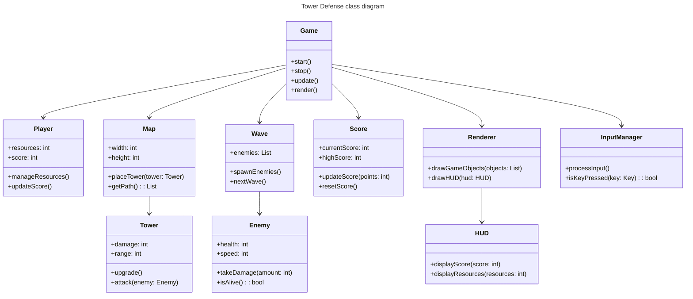

# UML Class Diagram for Tower Defense Game

```mermaid
---
title: Tower Defense class diagram
---
classDiagram
    class Game {
        +start()
        +stop()
        +update()
        +render()
    }

    class Player {
        +resources: int
        +score: int
        +manageResources()
        +updateScore()
    }

    class Tower {
        +damage: int
        +range: int
        +upgrade()
        +attack(enemy: Enemy)
    }

    class Enemy {
        +health: int
        +speed: int
        +takeDamage(amount: int)
        +isAlive(): bool
    }

    class Map {
        +width: int
        +height: int
        +placeTower(tower: Tower)
        +getPath(): List<Coordinate>
    }

    class Wave {
        +enemies: List<Enemy>
        +spawnEnemies()
        +nextWave()
    }

    class Score {
        +currentScore: int
        +highScore: int
        +updateScore(points: int)
        +resetScore()
    }

    class Renderer {
        +drawGameObjects(objects: List<GameObject>)
        +drawHUD(hud: HUD)
    }

    class HUD {
        +displayScore(score: int)
        +displayResources(resources: int)
    }

    class InputManager {
        +processInput()
        +isKeyPressed(key: Key): bool
    }

    Game --> Player
    Game --> Map
    Game --> Wave
    Game --> Score
    Game --> Renderer
    Game --> InputManager
    Map --> Tower
    Wave --> Enemy
    Renderer --> HUD
```